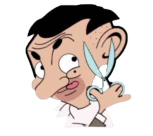
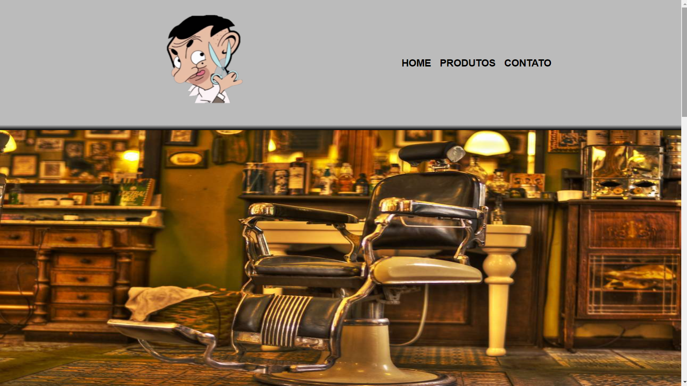
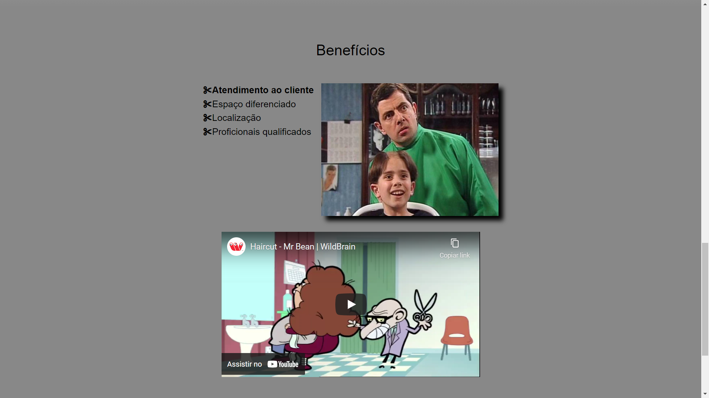
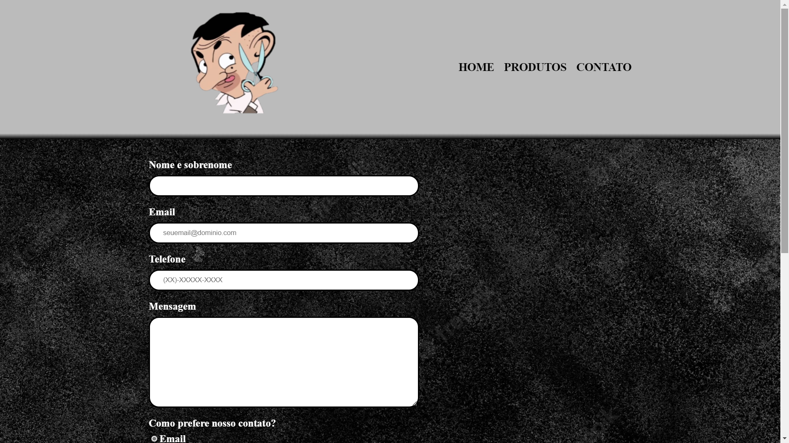
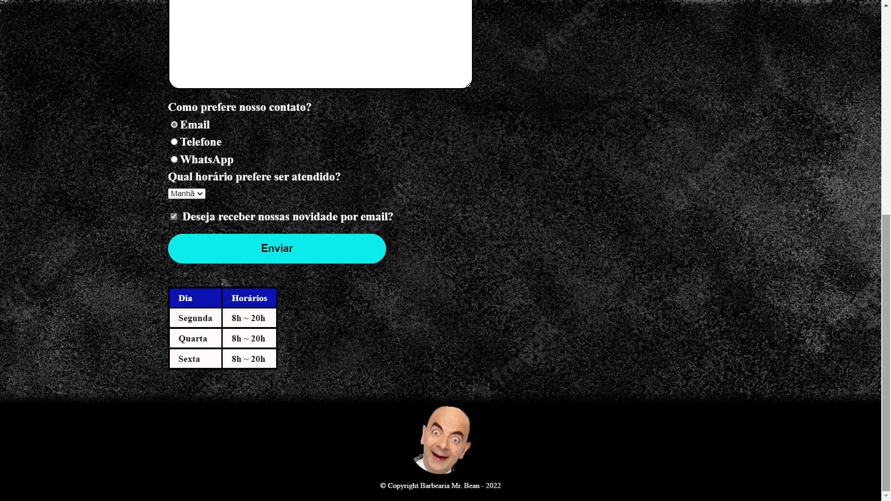

    

<b><h1 align="center">Barbearia Mr. Bean</h1></b>

## Índice

1. [Sobre](#Sobre)
2. [Objetivo](#Objetivo)
3. [Tecnologias e ferramentas](#Tecnologias-e-ferramentas)
4. [Projeto](#Projeto)
5. [Desenvolvimento](#Desenvolvimento)

# Sobre

Primeiro projeto de site usando HTML e CSS, com página inicial, página de produtos e página de contato.

  

# Objetivo

Projeto de barbearia desenvolvido para aprendizagem de HTML e CSS.

  

# Tecnologias e ferramentas

Este projeto foi desenvolvido com HTML e CSS.

  

# Projeto

Estas são algumas demonstrações do projeto Barbearia Mr. Bean:

<h2 align="center">Página inicial</h2>

<h2 align="center">Página inicial</h2>

<h2 align="center">Página inicial</h2>

<h2 align="center">Produtos</h2>

<h2 align="center">Contato</h2>

<h2 align="center">Contato</h2>

  

# Desenvolvimento

Este projeto foi desenvolvido por:

## Melquisedeque Paidosz - Aluno na Kenzie Academy Brasil

[LinkedIn](https://www.linkedin.com/in/melquisedeque-paidosz-da-silva/)

[Github](https://github.com/wikeed)

  

